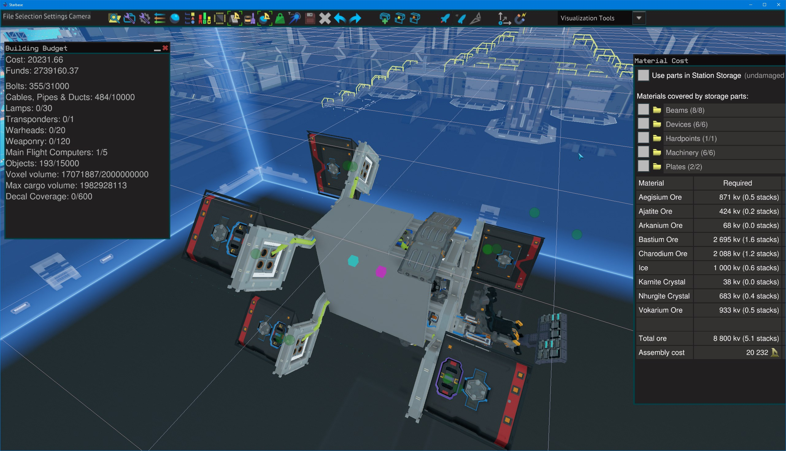
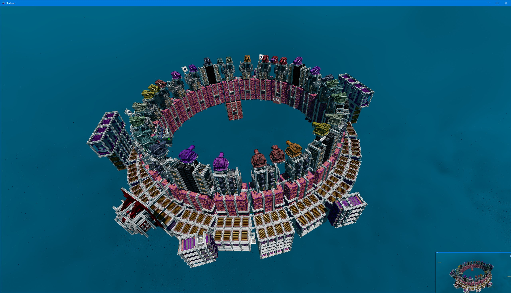
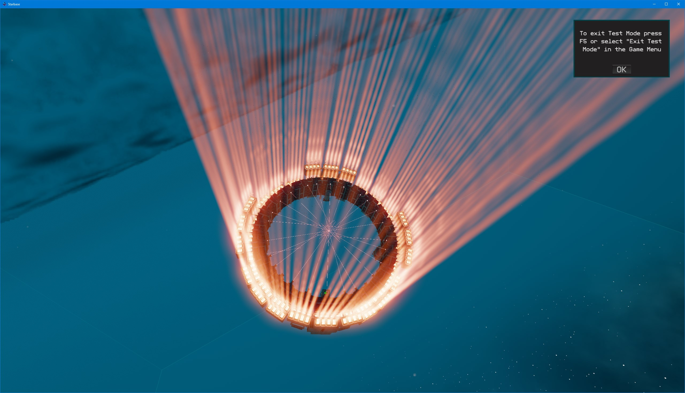
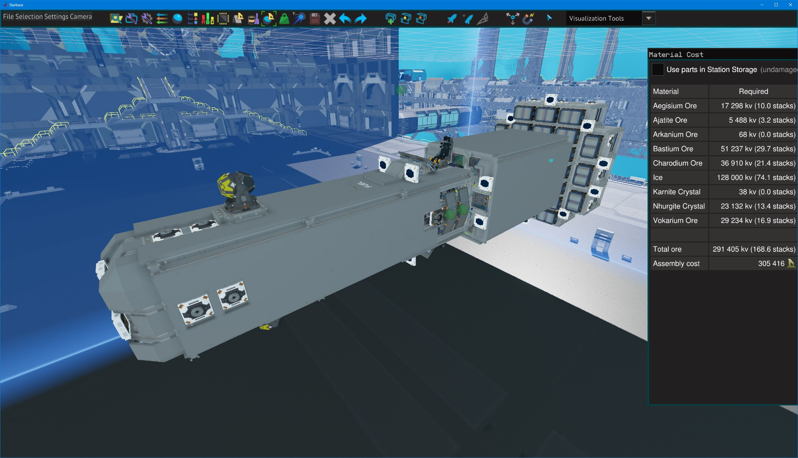
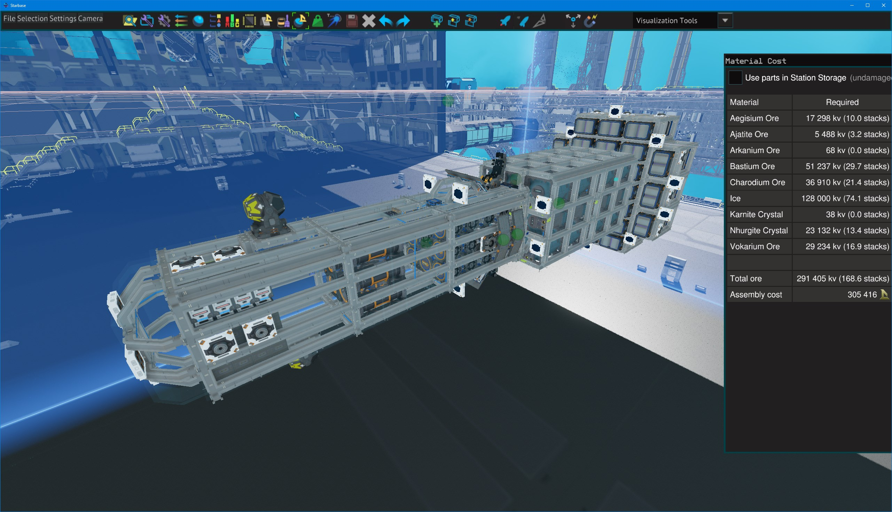
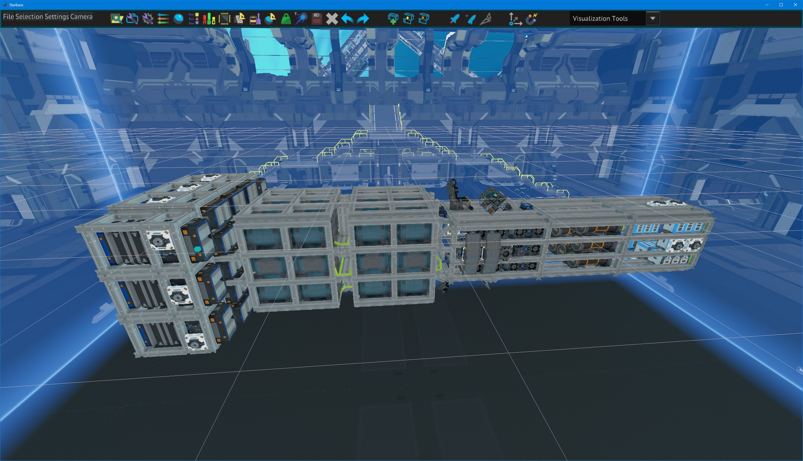
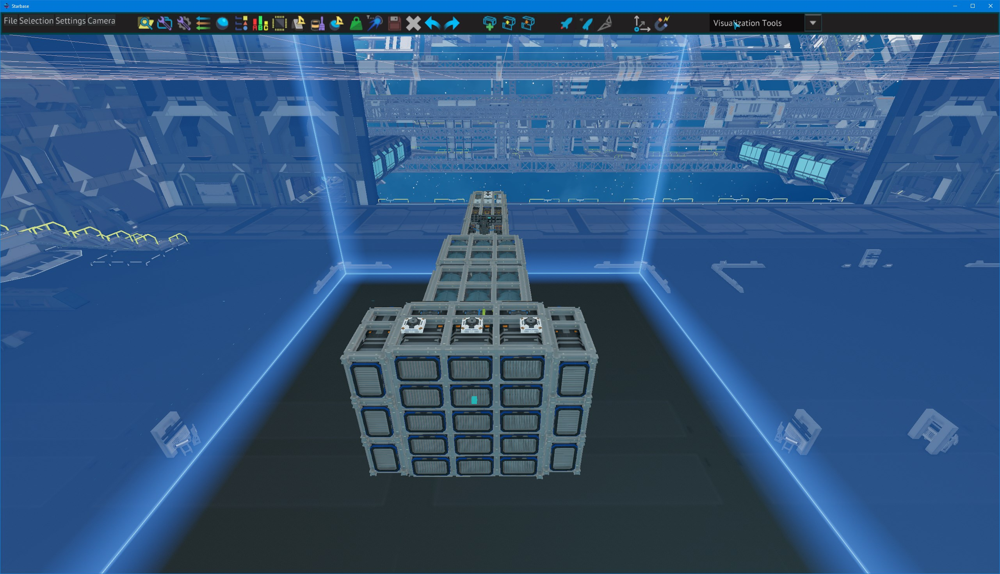
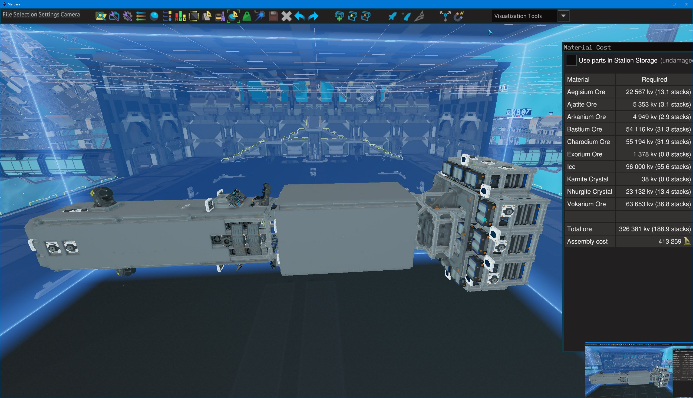

# Starbase Ship Designs

Decker's Ships; Donations are appreciated :).

## Vigil-EmptyFrame.fbe - testing engine module structure; modifications in progress, required radiators, and the 

actual built version had to be manually modified; need to remove some thrusters(?).

- Thrusters, generator, cockpit; how fast is the fastest thing?  *spoiler - depressingly slow compared to everything else*
- 526,513kg, 15TMR

## Vigil-mini.fbe 

Revisted Mini ship frame.  20k assembly cost :)

- Single receiver ISAN.
- 4 T2 triangle thrusters - 7.2TMR.
- no warp, no cargo, 2 hour propellant range 4 hour fuel range.
- single generator

## Vigil-ResearchVessel.fbe (Vigil RV)

Initial upgrade of vigil frame to support some utility, and beams to support rigid bolting of ore onto the sides (ore is 5:4 ratio of size, sortof).

- 40 working crates
- beam structure for bolting extra ore - 120 extra slots (4*20+4*10).
- 2 mining lasers 1 ore collectr
- 2 tractor beams
- 3 spots to mount cargo locks (empty frames, never completed the mods on the BP)
- warp core
- requires a crafting bench or 2 mounted for balance.
- long distance
- 3,583,140kg, 7.9TMR empty, 5.4TMR cargo full, less with ore bolted to frame.

## Vigil-BoxFrame (Vigil BF)

Replaces beams with cargo lock frames that can hold ore instead - single button locks and unlocks; 

- 40 working crates
- 256(54*4+4*9) ore in cargo frames; frames are slighly larger than ore blocks and other things like warp cores or thrusters
could be carried.
- quad ISAN2
- 2 mining lasers 1 ore collector on syncrhonized turrets
- warp core
- requires a crafting bench or 2 mounted for balance.
- long distance
- 4,891,903kg, 6.6 TMR empty, full is hard to measure

## Ring of Fire

This is a mining ship; it is meant to encompass and comsume asteroids.  It has the option of being a moon mining vessel also.
Ring Of Fire - dual ring of thusters (192)

- [Owners Manual](Rof-OwnersManual/RingOfFire.md)
- 600 cargo crates
- 24 mining lasers (96 weapon points)
- 6 ore collectors,
- 4*24 (96) t2 box thrusters for main engines, 8 downup/down 8 left/right (16 roll).
- 1200km distance or so (3.5-4 hours propellant, 4-4.5 hours fuel)
  - 72M Propellant
  - 38 T2 Fuel Chambers, 78 (2*38+2) replacment fuel rods
- 17.1M kg, 5.88TMR empty, 2.3TMR(40k crate load).
- warp core
- power systems to the front, center of thrust behind center of mass, mining lasers closer than V2.  Put power systems on top of ring for moon mining mode.
- Turtle, Cruise; also Overdrive which enables both rings.

## RingOfFire-base

Ring Of Fire - 1 ring of thrusters, and maneuvering thrusters, rough dual mode cockpit with beams to sense
pilot in seat... (fails under high rotation rates in certain directions).  

- 576 cargo crates
- 24 mining lasers (100 weapon points)
- 6 ore collectors,
- 4*24 (96) t2 box thrusters for main engines, 8 downup/down 8 left/right (16 roll).
- 600km distance or so
- 13M kg, 2.4TMR empty, 1.3 40k crate load.

## Ring of Fire - Fixed Engines

The clone/rotate function of SSC ate one of the pipe segments on 2 engine blocks; this has that fixed - needs MFC fixed... I have a module for it- (version built for ticket)

## Ring of Fire - V2 

Alternate Balance - moves the CoM nearly 4m behind CoT; improved power system, manual/auto sweep mining, a couple different patterns for mining lasers firing order.
Power system behind crates/thrusters in the forward/ring direction, but on the underside for moon mining.
Improved fuel capacity and 2x refuel available; prioritized battery management.

- [Owners Manual](Rof-OwnersManual/RingOfFire.md)

## Dart - V1

- 128M propellant (31 hours) (114M Excess propellant for 3 hour trip)
- 27 thrusters 
- 6.21TMR
- 8 Fuel Chambers, 8 Generators, 8 spare fuel rods (3 hours)
- Avoidance Script
- Origin Compass Script
- Single Receiver ISAN
- Smarter Battery Charge Script
- 310,000 (approx) credits

## Dart 7 

- 32M Propellant(otherwise same as above, which might classify more as refueler)
- 7 hours propellant, 3.5 hours fuel, with 1 set of replacemnt fuel rods.
- 252,361 credits

### Initial version

## Dart W - V1

- Adds warp core, removes 32M propellant (96M) to keep TMR>6.
- 410,000 (approx) credits

## Dart 192

Increases propellant slightly - realized I already had twice what I meant to have... 
adding double again dropped the TMR to 5.35.

192M propellant, 8 fuel chamber 8 generator, 21 thrusters, 6.1TMR

## Dart V2

This Version revises the structure and makes the profile longer and thinner at the cost of some wasted thrust at opposing angles.

- Doubles Fuel Chambers, lasts for 8 hours, 7.5 hours propellant.
- 6.51TMR.

# Changelog

- Ring of Fire(V2) Updated, strength factor 32 (11 fully loaded, 17 half max load); fixed missing pipe on thruster(R3), fixed flight status lockout, fixed fuel scripts, export x, y, z, speed variables from ISAN, shows estimated time to empty better.
- Dart-V1 removed enhancers since speed is the only purpose of the thing; developed improved battery managment script.
- Ring of Fire(v2) Updated, strength factor improved power script, added mining laser dropout at low battery.
- Ring of Fire(Release1) Replaced power systems.  Added improved battery script, adds some weight from RC1.
- Ring of Fire v2 added plating around moving parts... Dart - Connected resource ports
- Added Dart 7
- Ring of Fire - Added emergency propellant refill switch; so a single (or pair) tank can be removed to be filled.  Fixed engine naming; add additional crosshair range finders.  Fixed some control sliders.  Fixed ISAN speed reference.