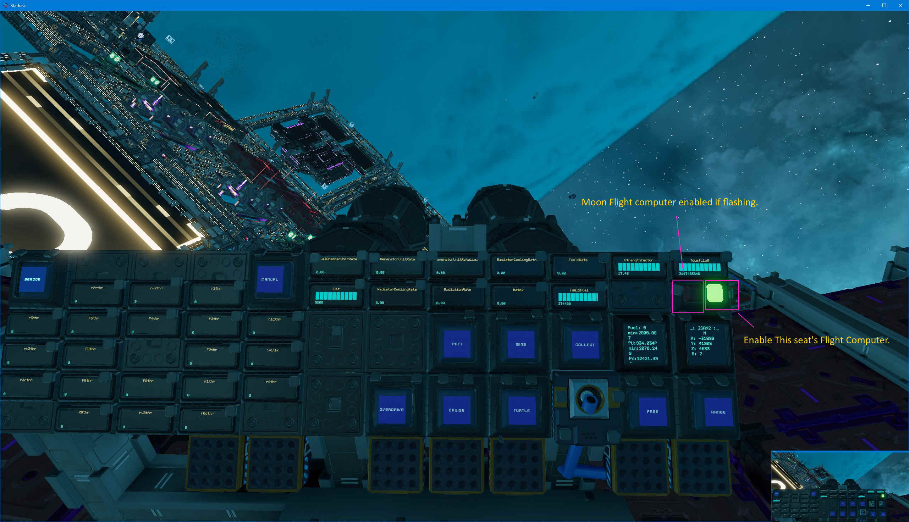
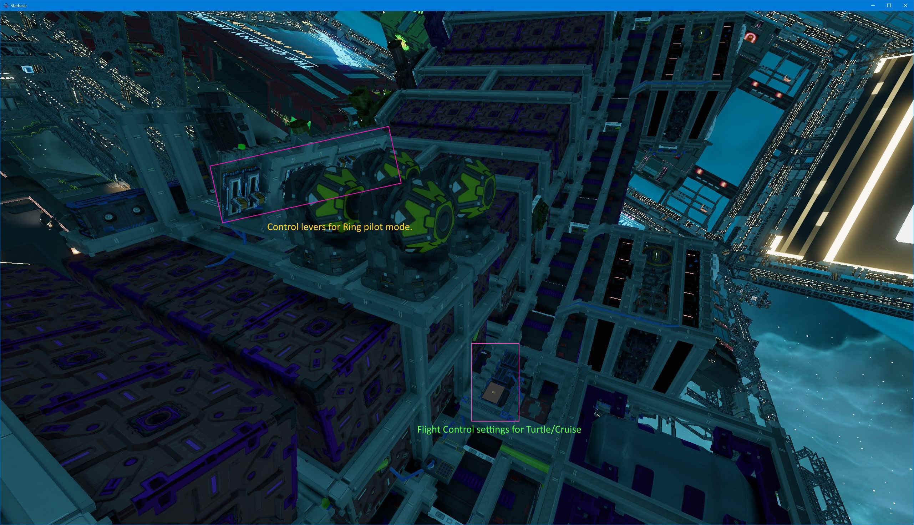
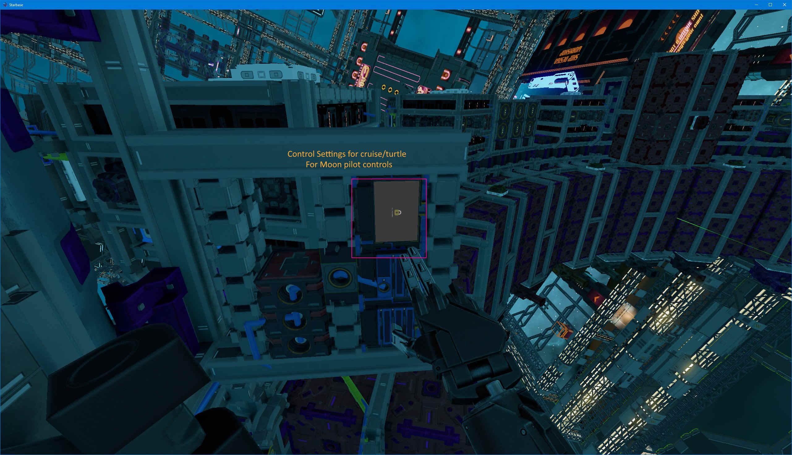

# Ring Of Fire 

Important! It takes a minute (more than 20 seconds) to boot the ship.  Until you see a readout on `StrengthFactor` it's not ready to fly.  
You will need to select a flight computer mode before `StrengthFactor` will update; the diagnostic scanner is in the same network as the cruise/turtle script and
the flight computer.

Controls include turtle, eco, and overdrive thruster contfigurations.
This ship uses an adanced flight computer and supports updown/rightleft controls.
Has dual mode flight computers - depending on the one selected determines the direction of `forward`/`up`.

Mining Lasers are configured with `MLUD+`, `MLUD-` and `MLLR+` and `MLLR-` for controlling the turrets.

(Mining lasers will move erratically if you rotate and move the turrets also; if the turrets are not moving, rotation of the ship does not affect them)

|Control| type | meaning |
|---|---|---|
| MLUD (+/-) | lever | Mining laser pitch up/down. (limited to asteroid mining range, moon mining ranges are unavailalbe) |
| MLLR (+/-) | lever | Mining laser left/right.  (narrow range, auto centers) |
| MLF (+/-) | lever | Controls the size of the scanning range of the auto sweeping script; a bigger number is further out; max is 30 degrees min is -6 and 10 is default. |
| Mine | button | enable mining lasers and ore collectors |
| Collect | button | Overidden by mining button |
| Manual | button | if Manual is enabled before enabling Mine, then lasers will be under slider control and accept pilot inputs.  Otherwise a script will run that will do a sweeping motion |
| Cruise | Button | Toggle cruise controls; Cruise makes yaw/pitch more lazy, and removes centering from forward/reverse controls |
| Turtle | Button | Toggles turtle controls; adjusts yaw/pitch/roll response, changes speed controls (may modify max throttle).  In a Ring of Fire, this button disables many engines also, so the max throttles remain at 100%|
| Overdrive | Button | Enables maximum thruster combination; This button requires the generator to be working a little, otherwise the batteries will end up draiining before the generator can actually get up to speed... (V2 has enable status light for overdrive mode)|
| Range | Button | Toggles main range finders for foward direction - helps aligning approach to asteroids. (Visual only, no scripting enabled) |
| Crosshair | Button | Toggles range finders used as crosshairs for mining region of the lasers; to know if a asteroid is in a good location before running the lasers |

### Mining Lever Settings

`MLUD` (Mining Laser Up Down) is limited to only 30 degrees; it can go to 160, and mine outside the ship. 
`MLLR` (Mining Laser Left Right) is limited to +/-45 degrees; any more and the lasers will cut into the ship itself; effective range for ring mining is +/-5 degrees; at 20m
a small change makes a big difference.

## Ring (main panel) 

THe left side has engine status readouts the center and right has normal operational notes.
There are two buttons to the upper right of the panel which indicate the status of flight computers; and enable flight computer for this seat.

## Ring (flight control settings)

Script in the reader is used to control yaw/pitch/throttle settings for cruise and turtle modes.  There are 4 modes, Normal, Cruise, Turtle and Cruise-Turtle.

## Moon mode statuses and buttons

To the upper left of the panel are two buttons that indicate the status of the other flight computer enable, and have a flight computer enable for this seat.

## Moon pilot settings

To the left of the pilot is the script that controls that seats cruise/turtle settings.

## V1 Patch notes (todo)

- range finder cross hairs (button)
- mining laser automation scripts
- pattern scripts
- rolling average power demand script
- MFC set needs to be replaced

## V2 Patch notes

- one half of a battery bank isn't connected.
- 2 or 3 other minor things were required?

